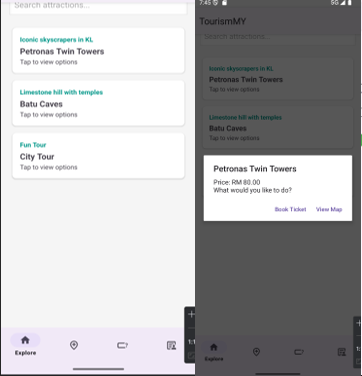
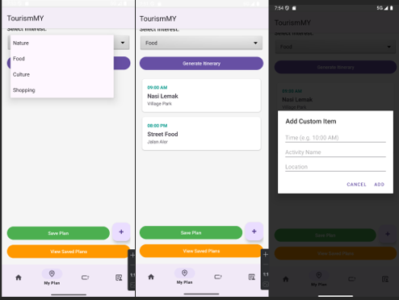
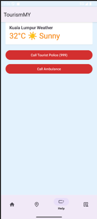
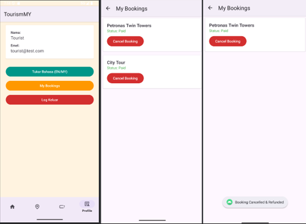
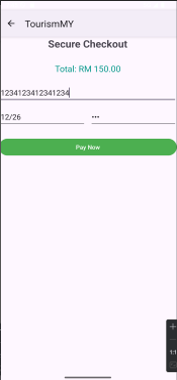
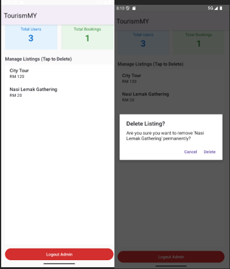
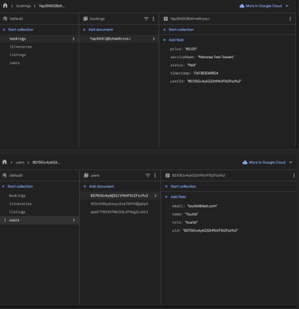

# TourismMY

Android prototype demonstrating a multi-role tourism platform with Firebase-backed authentication, service listings, and itinerary planning.

> ⚠️ This project is a **functional prototype** built for academic and learning purposes.  
> Core user flows are implemented, while some features are partial or simulated.

## Project Overview

TourismMY is an Android application prototype designed to explore how a single platform could connect tourists, local service providers, and administrators within the Malaysian tourism ecosystem.

The app focuses on:
- Role-based user experiences (Tourist, Business, Admin)
- Firebase-backed authentication and data storage
- A rule-based itinerary generator to assist travel planning
- Basic safety and localization features

## User Roles

- **Tourist**  
  Browse attractions and services, generate itineraries, manage bookings, and access safety features.

- **Business Owner**  
  Create and manage service listings, view incoming bookings, and update availability.

- **Administrator**  
  Monitor platform data, view system metrics, and moderate listings.

## Features

### Authentication & Access Control
- ✔ Firebase Authentication (login & registration)
- ✔ Role-based routing (Tourist / Business / Admin)

### Tourist Features
- ✔ Browse tourism services and attractions
- ◐ Rule-based itinerary generator (interest-based, prototype logic)
- ◐ Booking flow (happy-path only)
- ✖ Real payment processing (simulated in prototype)
- ✔ Emergency call shortcuts (police / ambulance)
- ◐ Language switching (English / Malay, limited scope)

### Business Features
- ◐ Business dashboard for managing listings
- ✔ Firestore-backed listing creation and updates
- ◐ Basic booking visibility (limited validation)

### Admin Features
- ✔ Admin panel for viewing users and bookings
- ✔ Listing moderation via Firestore

## Screenshots

### Tourist (User Side)

| Explore | Itinerary | Help |
|--------|-----------|------|
|  |  |  |

| Profile | Payment |
|---------|---------|
|  |  |

---

### Business Side

| Business Portal |
|-----------------|
|  |

---

### Admin Side

| Admin Dashboard | Firebase Database |
|-----------------|------------------|
|  |  |

